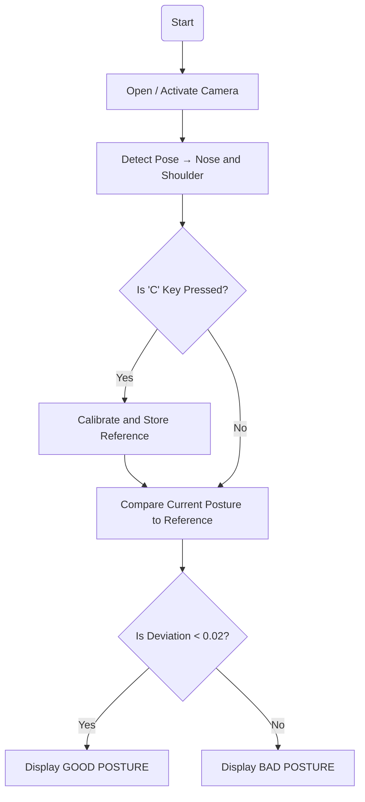

# **GROUP .ENV: Real-Time Posture Detection**

## Problem Statement
> - Poor posture is a common problem among students, office workers, and computer users. Sitting for long periods with bad posture can cause back pain, neck strain, and long-term spinal issues. Many users are unaware when they start slouching. This AI system aims to detect poor posture in real time and alert the user before health issues develop.

## Proposed Solution Overview
> - The system uses a webcam and AI-based human pose estimation **(MediaPipe Pose)** to track key body points such as the nose and shoulders. It measures the vertical distance between the nose and shoulders to determine whether the user is maintaining an upright position.
> - After calibration, the system continuously monitors posture — displaying **“GOOD POSTURE”** in green when upright and **“BAD POSTURE”** in red when slouching. The program provides visual feedback on-screen, and can be extended to include sound alerts or reminders.

## PEAS Model
|Performance Measure | Environment | Actuators | Sensors | 
| ------ | ------ | ------ | ------ |
| Posture detection accuracy (correct classification of good vs. bad posture), real-time responsiveness, and user awareness (how often users correct their posture after feedback). | Virtual environment using the user’s webcam feed in real time. Operates indoors with stable lighting and a clear upper-body view. | Visual display through the OpenCV window: colored lines, posture labels ("GOOD" / "BAD"), and optional text instructions for calibration. | Webcam camera acts as the main sensor; MediaPipe Pose extracts key landmark coordinates (nose, left shoulder, right shoulder). | 

## AI Concepts Used
| Intelligent Agent Type | Search or Optimization Strategy | Learning or Decision Component (if applicable) | 
| ----- | ----- | ----- |
|**Model-based reflex agent** – it uses a model of the human body posture (nose–shoulder distance) and reacts accordingly by classifying posture as good or bad. | Not a search-based system, but uses **threshold-based decision logic** to minimize deviation from the calibrated reference distance. (You can describe this as a simple **optimization** where the goal is to keep the posture distance close to the ideal reference.) | Uses **calibration-based learning** — the system learns the user’s reference (good) posture when they press ‘C’, and compares future postures to that baseline. Decision-making is based on deviation thresholds (if difference < 0.02 → good posture). |

## System Architecture Diagram

## Contributors
### Presenters
- Zyrus Alvez
- France Raphael Rivera
- Richard Torculas
### Presentation Creator
- Allan John Funelas

## Presentation Link
`Click Here ->`
[Canva Presentation Link](https://www.canva.com/design/DAG2y6pdYQY/ScdPUmw5GfVrm7Tsbt9qoQ/edit?utm_content=DAG2y6pdYQY&utm_campaign=designshare&utm_medium=link2&utm_source=sharebutton)