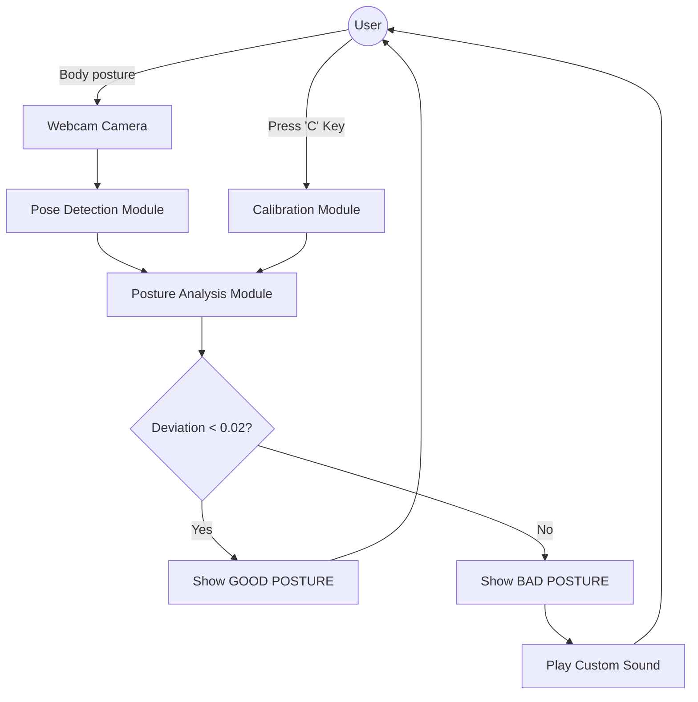

# **GROUP .ENV: Real-Time Posture Detection**

## Documentation Link
`Click Here ->`
[Google Docs Link](https://docs.google.com/document/d/1sJkZqmhtHJWSdU9Pu-WKlFU069b5qBsD/edit?usp=sharing&ouid=101178444166492044070&rtpof=true&sd=true)

## Presentation Link
`Click Here ->`
[Canva Presentation Link](https://www.canva.com/design/DAG5Yt2qrMo/JMY8pqkjFTPp2zy5P4kF1A/edit?utm_content=DAG5Yt2qrMo&utm_campaign=designshare&utm_medium=link2&utm_source=sharebutton)

## Problem Statement
> - Poor posture is a common problem among students, office workers, and computer users. Sitting for long periods with bad posture can cause back pain, neck strain, and long-term spinal issues. Many users are unaware when they start slouching. This AI system aims to detect poor posture in real time and alert the user before health issues develop.

## Proposed Solution Overview
> - The system uses a webcam and AI-based human pose estimation **(MediaPipe Pose)** to track key body points such as the nose and shoulders. It measures the vertical distance between the nose and shoulders to determine whether the user is maintaining an upright position.
> - After calibration, the system continuously monitors posture — displaying **“GOOD POSTURE”** in green when upright and **“BAD POSTURE”** in red when slouching. The program provides visual feedback on-screen, and can be extended to include sound alerts or reminders.

## PEAS Model
|Performance Measure | Environment | Actuators | Sensors | 
| ------ | ------ | ------ | ------ |
| Posture detection accuracy (correct classification of good vs. bad posture), real-time responsiveness/latency (time from posture change to feedback), and user awareness/behavioral change (how often users correct their posture after feedback). | A Partially Observable, Dynamic indoor setting where the user is performing a desk task. The user can be sitting or standing. The primary constraint is a clear camera view of the left and right shoulders. The system is robust enough to tolerate partial face obstruction (e.g., masks). | Visual Display (OpenCV window showing colored lines and posture labels "GOOD POSTURE"/"BAD POSTURE") AND Auditory Alert/Sound (to immediately alert the user when their posture is classified as bad). | Webcam Camera (main sensor) and MediaPipe Pose, which extracts key landmark coordinates, specifically focusing on the left and right shoulders. It utilizes its occlusion handling and prediction capabilities to reliably estimate the center of the face/nose even when it is partially obscured or not fully visible. | 

## AI Concepts Used
| Intelligent Agent Type | Search or Optimization Strategy | Learning or Decision Component (if applicable) | 
| ----- | ----- | ----- |
|**Model-based reflex agent** – it uses a model of the human body posture (nose–shoulder distance) and reacts accordingly by classifying posture as good or bad. | Not a search-based system, but uses **threshold-based decision logic** to minimize deviation from the calibrated reference distance. (You can describe this as a simple **optimization** where the goal is to keep the posture distance close to the ideal reference.) | Uses **calibration-based learning** — the system learns the user’s reference (good) posture when they press ‘C’, and compares future postures to that baseline. Decision-making is based on deviation thresholds (if difference < 0.02 → good posture). |

## System Architecture Diagram

```mermaid
graph TD

    User((User)) -->|Body posture| Cam[Webcam Camera]

    Cam --> Detect[Pose Detection Module]

    Detect --> Analysis[Posture Analysis Module]

    User -->|Press 'C' Key| Calib[Calibration Module]
    Calib --> Analysis

    Analysis --> Decision{Deviation < 0.02?}

    Decision -->|Yes| Good[Show GOOD POSTURE]
    Decision -->|No| Bad[Show BAD POSTURE]

    Bad -->Beep[Play Custom Sound]

    Good --> User
    Beep --> User

```

## Contributors
- Zyrus Alvez
- Allan John Funelas
- France Raphael Rivera
- Richard Torculas
